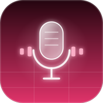
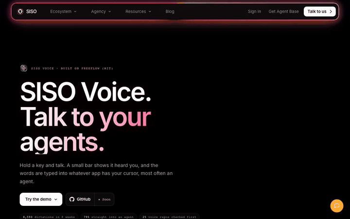

<!-- siso-os:header (generated by sisodias/siso-os-release from repos.json; edit there, not here) -->
<p align="center">
  <a href="https://www.sisolabs.space/voice/"></a>
</p>
<h1 align="center">SISO Voice</h1>
<p align="center"><b>Talk to your agents: fast dictation for macOS on Groq Whisper, with Apple's on-device recognizer as backup.</b></p>
<p align="center">
  <a href="https://www.sisolabs.space/voice/"></a>
  <a href="https://github.com/siso-os/siso-voice/blob/HEAD/LICENSE"></a>
  <a href="https://github.com/siso-os"></a>
  <a href="https://github.com/siso-os/siso-voice/stargazers"></a>
</p>
<p align="center">
  <a href="https://www.sisolabs.space/voice/"></a>
</p>
<p align="center">
  <a href="https://www.sisolabs.space/voice/"><b>Website</b></a> · <a href="https://docs.sisolabs.space">Docs</a> · <a href="https://github.com/siso-os">Every SISO OS project</a>
</p>

<!-- /siso-os:header -->

Hold a key, talk, and your words are typed wherever your cursor is. SISO Voice is fast dictation for macOS on Groq Whisper,
with Apple's on-device recognizer as backup. It is how we talk to our agents all day.

It is built on [FreeFlow](https://github.com/zachlatta/freeflow) by Zach Latta (MIT), with the talk-back idea from
[voicemode](https://github.com/mbailey/voicemode) (MIT). More on [the website](https://www.sisolabs.space/voice/).

## Install

You need macOS 13 or later, the Xcode command line tools (`xcode-select --install`) and a free Groq API key from
[console.groq.com/keys](https://console.groq.com/keys). It takes about five minutes.

1. **Make a signing certificate, once.** macOS ties the microphone and accessibility permissions to the app's signature, so
   SISO Voice is signed with a stable local certificate instead of an ad-hoc one. Open Keychain Access, then
   Keychain Access > Certificate Assistant > Create a Certificate. Name it `SISO Voice Dev Local`, set Identity Type to
   Self Signed Root and Certificate Type to Code Signing, and create it.
2. **Build and install:**
   ```bash
   git clone https://github.com/siso-os/siso-voice.git
   cd siso-voice
   ./install-standalone.sh
   ```
   This builds `SISO Voice.app`, puts it in `/Applications` and starts it at login.
3. **Set it up:** open SISO Voice, paste your Groq key, and allow the microphone and accessibility when macOS asks.

## Use it

- Hold `Fn` and talk; let go and the text is pasted into the field you are in.
- Or tap `Right Option` to start and stop.
- Both shortcuts can be changed in settings.

## Features

- **Context-aware cleanup:** it reads nearby app context so names, terms and phrases are spelled right in email, terminals
  and docs.
- **Custom vocabulary:** add names, jargon and project words it should keep as you say them.
- **Edit mode:** highlight text and say what to do with it ("make this shorter", "turn this into bullets").
- **Any OpenAI-compatible provider:** Groq by default, or your own model and API URL in settings.

## Privacy

There is no SISO Voice server. The only data that leaves your Mac is the API calls to the transcription and model provider
you configure.

## Licence

MIT, as FreeFlow. See [LICENSE](LICENSE).